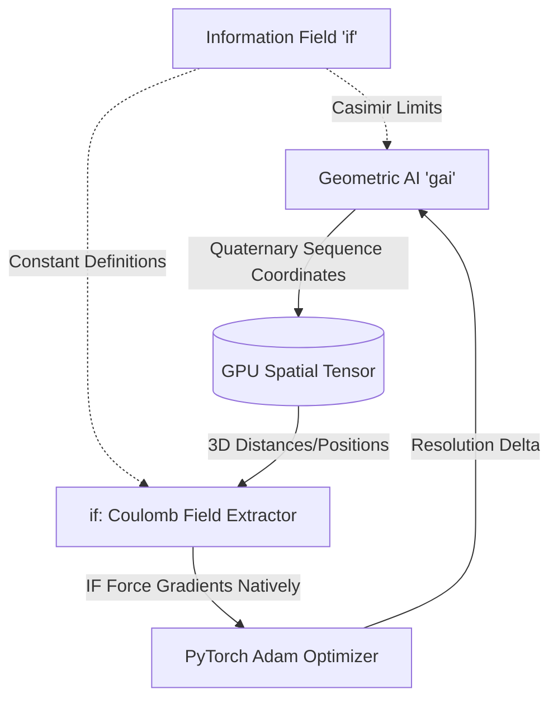

# Information Field (IF) Theory Parity Sync

This specification identifies exactly how IF Theory structurally decouples from `gai` natively and operates autonomously as an external Cosmological Force processor natively resolving PyTorch mathematical boundaries.

## Geometric AI Binding Topology

### Protocol Execution
- **Location**: `~/projects/if/code/if_theory/coulomb_fields.py`
- **Methodology**: Operates absolutely $O(1)$ over `torch.cdist` matrices tracking topological Toroidal Fields recursively overriding classical Thermodynamic heuristic interactions mathematically.
